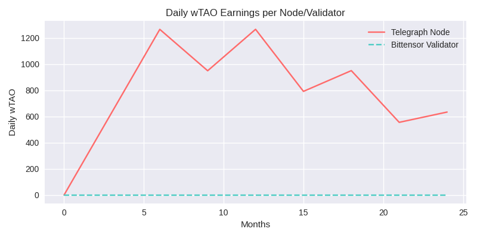
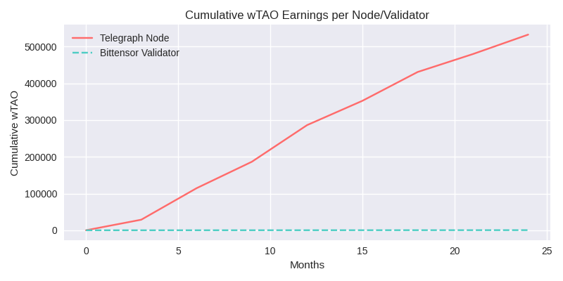
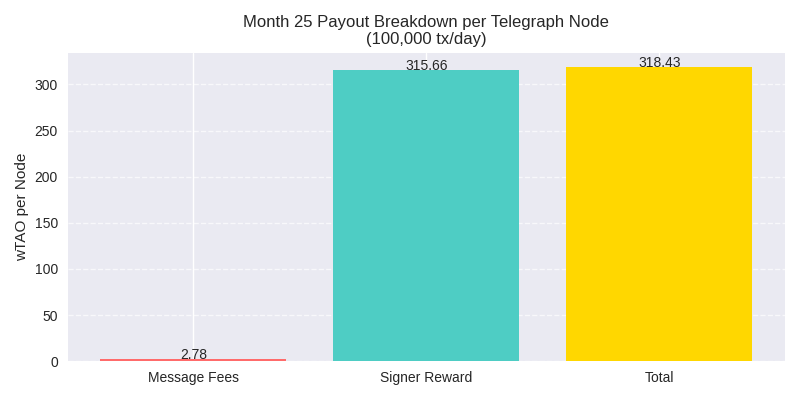

# Telegraph vs. Bittensor: Node Comparison for Investors

This section compares **Telegraph** and **Bittensor**, focusing on fees, rewards, and earnings potential to help investors evaluate the benefits of running a node. All rewards and fees for Telegraph are in wTAO.

### Fee Structures

#### Telegraph

* **Cross-Chain Message Fee**: 0.0025 wTAO per message
* **Subnet Message Fee**: 0.003 wTAO per message
* **Fee Distribution**: Fees are collected in wTAO and distributed equally among all nodes (e.g., 99 nodes).

#### Bittensor

* **Network Fees**: Based on computational resource usage, paid in TAO tokens. Exact fees vary, but validators earn a fixed reward.
* **Fee Distribution**: Validators earn approximately 0.5 wTAO per day from block rewards, while miners earn based on computational contributions.

***

### Rewards and Emissions

#### Telegraph

* **Rewards**: Paid in wTAO from fees collected; no new token minting.
* **Fee Collection**: 0.0025 wTAO per cross-chain message and 0.003 wTAO per subnet message.
* **Distribution**: Fees are split equally among all nodes.

#### Bittensor

* **Token**: TAO
* **Block Reward**: 1 TAO per block (12-second block time), halving every 4 years
* **Max Supply**: 21 million TAO tokens
* **Distribution**: Rewards are distributed to validators and miners, with validators earning a consistent \~0.5 wTAO/day.

***

### Fee Splits

#### Telegraph

* **Message Fees**: Split equally among all nodes. For example, with 100,000 cross-chain messages per day, the total fee pool is 250 wTAO/day (0.0025 wTAO/message × 100,000), split among 99 nodes = \~2.525 wTAO/node/day.

#### Bittensor

* **Fee Split**: Validators earn a fixed \~0.5 wTAO/day from block rewards, while miners’ earnings depend on computational contributions.

***

### Comparison Table

| Metric              | Telegraph                      | Bittensor                      |
| ------------------- | ------------------------------ | ------------------------------ |
| **Cross-Chain Fee** | 0.0025 wTAO/message            | N/A                            |
| **Subnet Fee**      | 0.003 wTAO/message             | N/A                            |
| **Daily Reward**    | Scales with transaction volume | \~0.5 wTAO (validators)        |
| **Reward Type**     | wTAO from fees                 | TAO from block rewards         |
| **Fee Split**       | Equal among nodes              | Validators + miners (variable) |

***

### Earnings Potential: Month 25 Example

Assuming 100,000 cross-chain transactions per day in month 25:

| Period  | Telegraph Node (wTAO) | Bittensor Validator (wTAO) |
| ------- | --------------------- | -------------------------- |
| Daily   | 2.525                 | 0.5                        |
| Monthly | 75.75                 | 15                         |
| Yearly  | 921.625               | 182.5                      |

_Note_: Earnings are from cross-chain fees only. Subnet fees would further increase Telegraph node earnings.

***

### Graphs

#### 1. Daily wTAO Earnings over 24 Months

* **Scenario**: Transaction volume grows linearly from 10 to 100,000 per day over 720 days.
* **Telegraph Node**: Starts at \~0.000253 wTAO/day, rises to \~2.525 wTAO/day.
* **Bittensor Validator**: Constant at 0.5 wTAO/day.
* **Crossover Point**: \~Month 4.7 (19,800 transactions/day).

<figure><figcaption></figcaption></figure>

Telegraph earnings increase linearly, surpassing Bittensor’s flat line around month 4.7

#### 2. Cumulative wTAO Earnings over 24 Months

* **Telegraph Node**: Reaches \~636 wTAO by month 24.
* **Bittensor Validator**: Reaches 360 wTAO by month 24.
* **Insight**: Telegraph nodes outpace Bittensor validators as transaction volume grows.

<figure><figcaption></figcaption></figure>

Telegraph’s curve accelerates upward, while Bittensor’s is a straight line.

#### 3. Payouts in Month 25 (100,000 tx/day)

* **Daily**: 2.525 wTAO/node
* **Monthly**: 75.75 wTAO/node
* **Yearly**: 921.625 wTAO/node

<figure><figcaption></figcaption></figure>

Bar chart showing daily, monthly, and yearly earnings for a Telegraph node.

***

### Why Invest in a Telegraph Node?

* **Scalability**: Earnings grow with network usage, unlike Bittensor’s fixed rewards.
* **High Potential**: At 100,000 transactions/day, Telegraph nodes earn over 5x more daily than Bittensor validators.
* **Long-Term Value**: As transaction volume increases, Telegraph nodes offer superior profitability, making them an attractive investment for those betting on network growth
